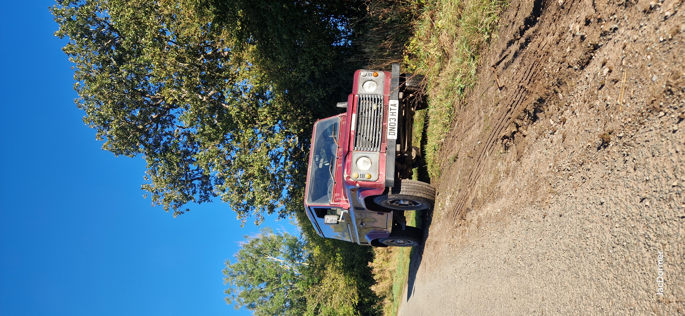

# Landrover

## Table of Contents

- [Introduction](#your-mission)
- [Headings](#headings)
- [Emphasis](#emphasis-italic-bold)
- [Code](#code)
- [Tables](tables.md)
- [Images](images.md)
- [Reflections](#reflections)
- **## Table of Contents

- Item A
  - Nested Item
1. First
2. Second
- [Introduction](#your-mission)
- [Headings](#headings)
[Visit OpenAI](https://www.openai.com)
- [Code](#code)
- [Tables](tables.md)
- [Images](images.md)
- [Reflections](#reflections)**
- # H1
## H2
### H3
*italic*  **bold**  _also italic_  __also bold__
`inline code`

```python
def greet():
    print("Hello!")
```
> not a quote.
